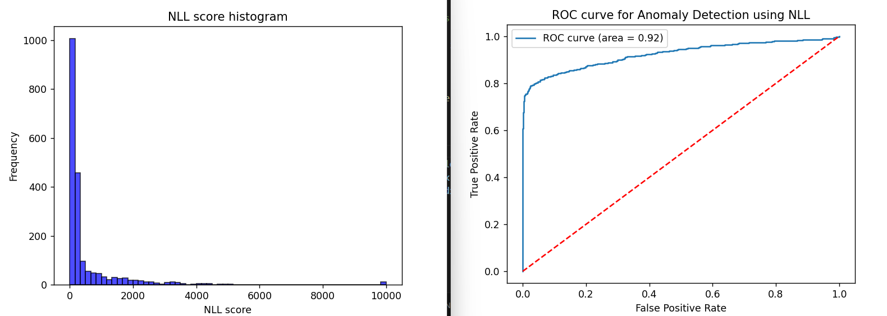

# SceneGraphGen

This is the implementation for the paper **Unconditional Scene Graph Generation**, ICCV 2021 | <a href="https://arxiv.org/pdf/2108.05884.pdf">arxiv</a>.

This work was done at the Technical University of Munich.

If you find this code useful in your research, please cite
```
@inproceedings{scenegraphgen2021,
  title={Unconditional Scene Graph Generation},
  author={Garg, Sarthak and Dhamo, Helisa and Farshad, Azade and Musatian, Sabrina and Navab, Nassir and Tombari, Federico},
  booktitle={IEEE International Conference on Computer Vision (ICCV)},
  year={2021}
}
```

## Setup

This repo has the following dependencies:
- numpy==1.19.5
- imageio==2.15.0
- scikit-learn==0.24.2
- networkx==2.5.1
- h5py==3.1.0
- tensorboard==2.8.0
- matplotlib==3.3.4
- pyyaml==6.0
- pytorch (install version compatible with your GPU. Ours is tested with torch version 1.4.0)

Note that the versions indicate what this model is tested on, but the code is not limited to them.

Drawing scene graphs to visualize results requires that GraphViz is installed:
```
sudo apt-get install graphviz
```

## Training

To train the model, first extract the <a href="https://drive.google.com/file/d/184TLc2NnTKeR-W0M_-8x5R9uUqs7SEDd/view?usp=sharing">custom_vg_dataset.zip</a> and place its content under `.\data`.

Then run:
```
python main_train.py
```

You can define the prefix of the experiment folder in `--run_folder`. This prefix will be automatically appended with additional hyperparameter list information.

## Evaluation
You can evaluate the model either from your own training or the available checkpoint <a href="https://drive.google.com/file/d/1eEhSLZhwd655M99fb-TqUT2qook4DQ7D/view?usp=sharing">here</a>. The downloaded checkpoint should be extracted and placed under `./models`, such that it has the structure `./models/usggen_<hyperparameters_list>`. 
Please make sure to provide the correct experiment name in `--hyperparams_str`. The default value is pointing to the provided checkpoint.

Note that the provided checkpoint does not exactly reproduce the official result in the paper. Also note that metric computation can vary, as it is computed on a random sample subset of the test set and generated set.

Run:
```
python main_eval.py --hyperparams_str <experiment_name>
```

By default, this code first generates the data and then computes the MMD metrics. 
In case the data for that model is already generated and you only wish to compute the metrics, please set `--gen_data 0`.

# Anomaly Detection results

Below are the results of the anomaly detection task. The model is trained on the custom VG dataset and evaluated on the test set.

The command we run this test is:
```
python anomaly_detect.py --corrupt_rate 0.3 --max_graph_count 2000
```

With corrupt rate of 0.3, detecting 2000 graphs, the model achieves the following results:

Optimal threshold: 365.2301330566406

True Positive Rate: 0.7912457912457912

False Positive Rate: 0.026334519572953737

AUROC: 0.9246653965515175


